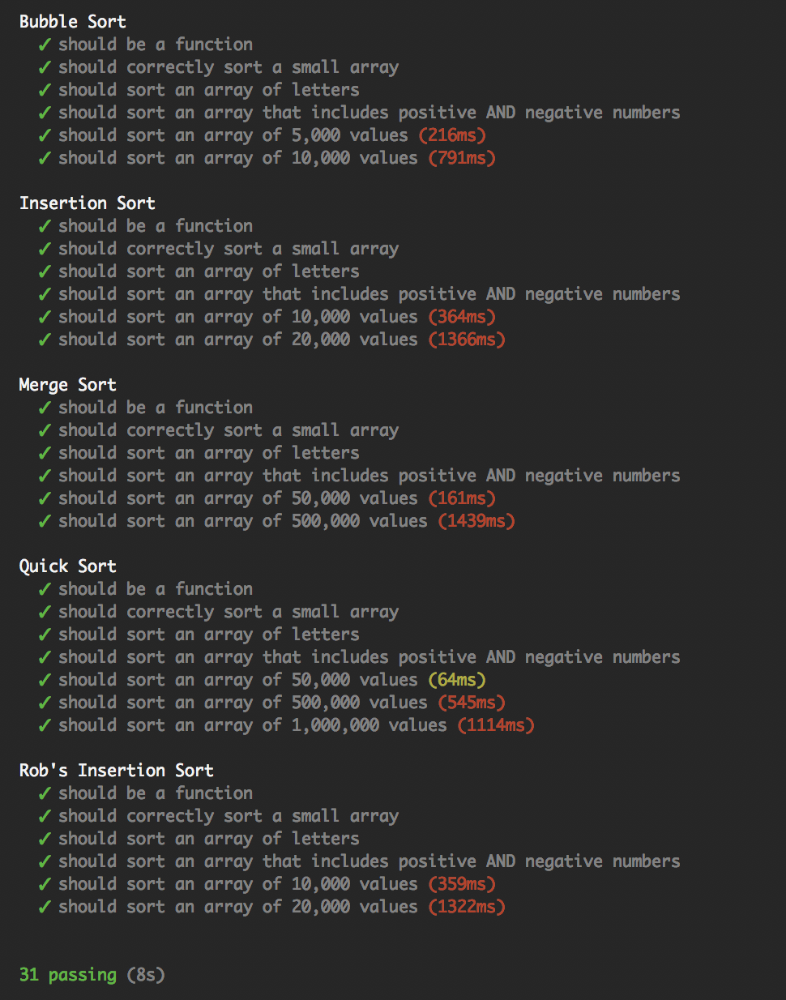

## Sorting Suite

Sorting Suite is a collection of sorting algorithms created for Turing School of Software & Design in less than a week.  It contains the following algorithms:

**Bubble Sort** - Simple and easy.  The first one everybody learns.

**Insertion Sort** - More performant than bubble sort and still easy to understand.

**Merge Sort** - A bit more complicated.  We were required to be able to live code Merge Sort.

**Quick Sort** - Very easy to work with and the most performant.  We were required to be able to live code this one as well.

**Rob's Insertion Sort** - I'm not sure this is technically an insertion sort.  I made it when I read about how it was supposed to work.  Though it isn't actually written correctly, it does work and is slightly more performant than the real insertion sort.  So I included it since I found it interesting.

*******

The screenshot I've included is of the test suite showing how many values can be sorted at a given speed.  Quick Sort performed the best.

